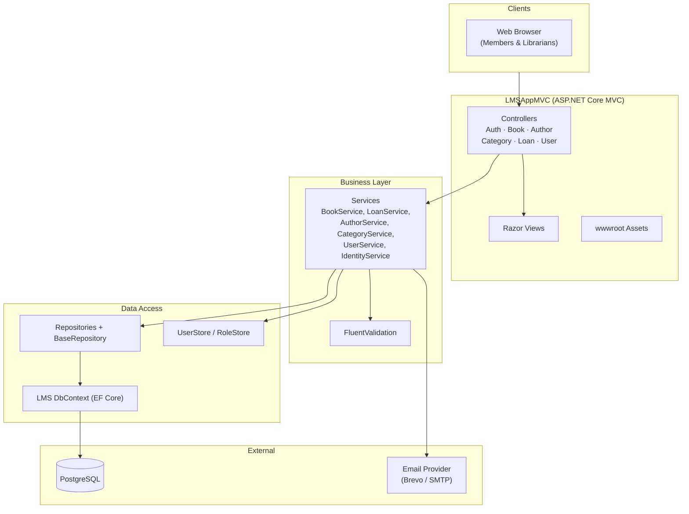
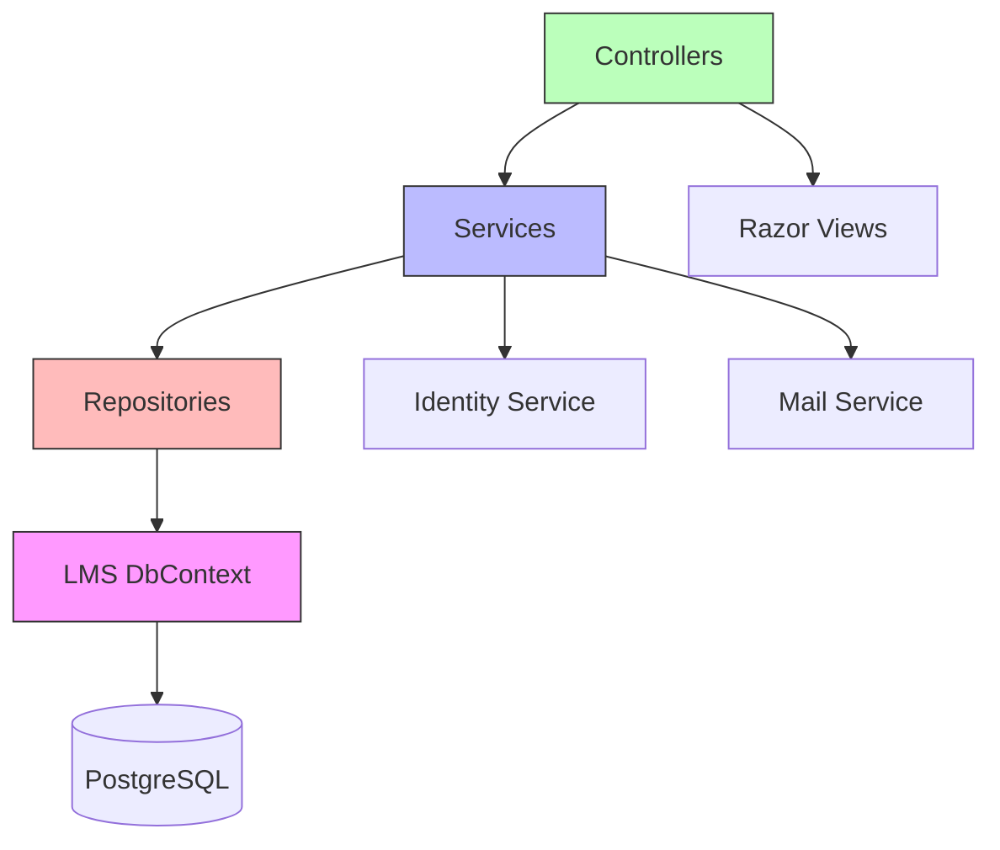
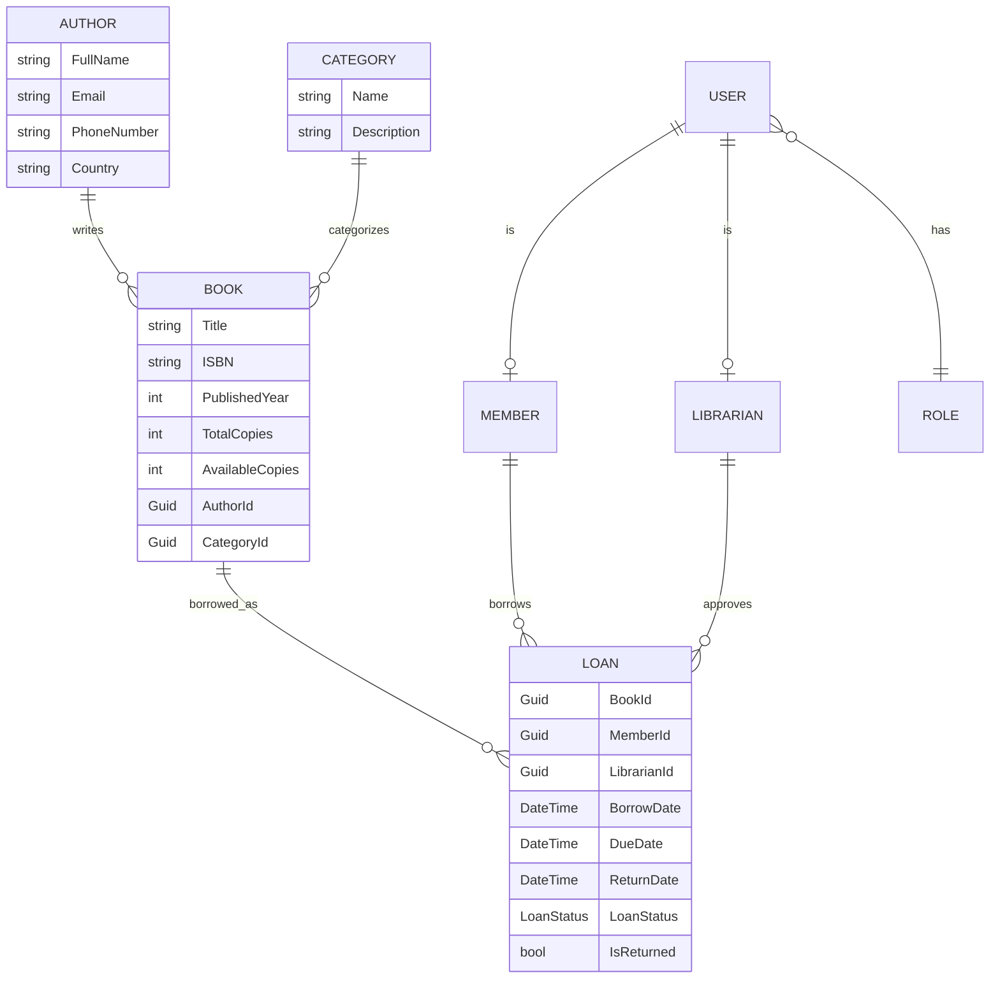
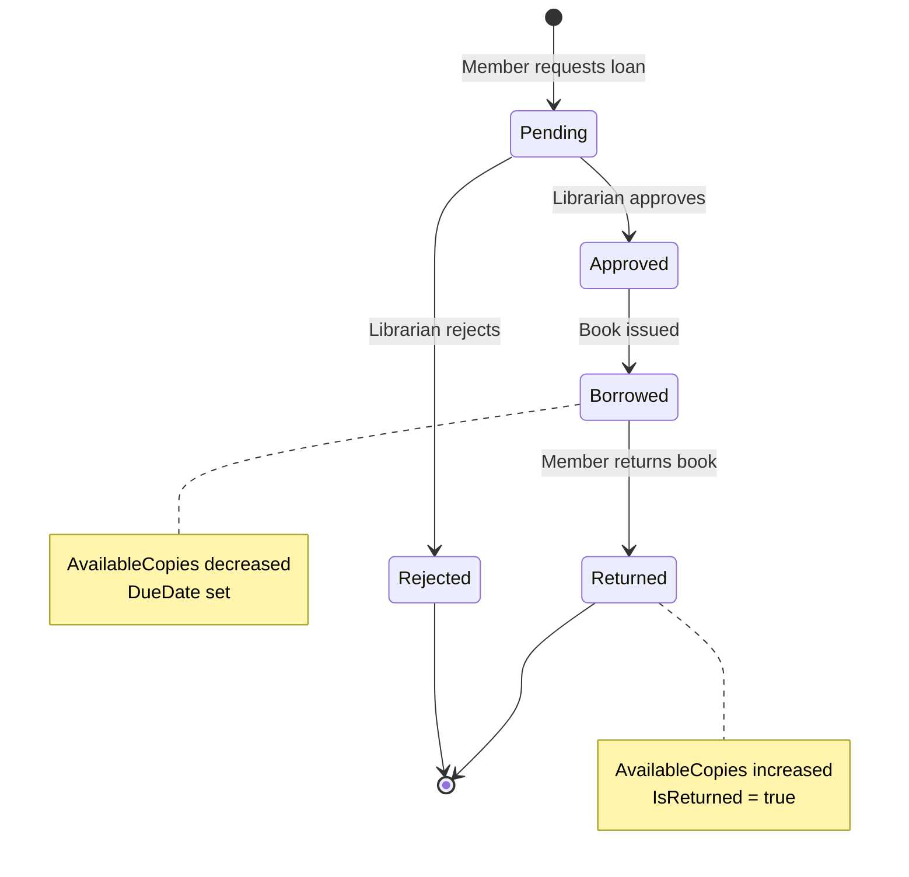
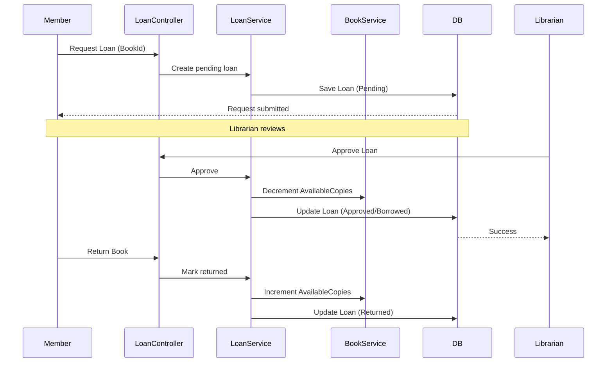
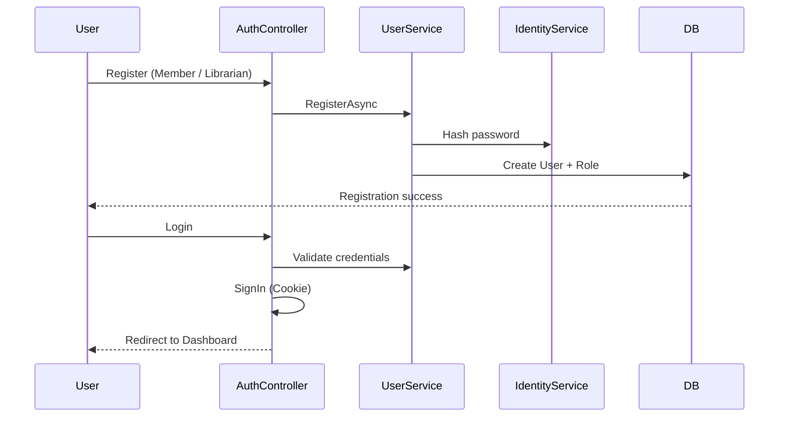
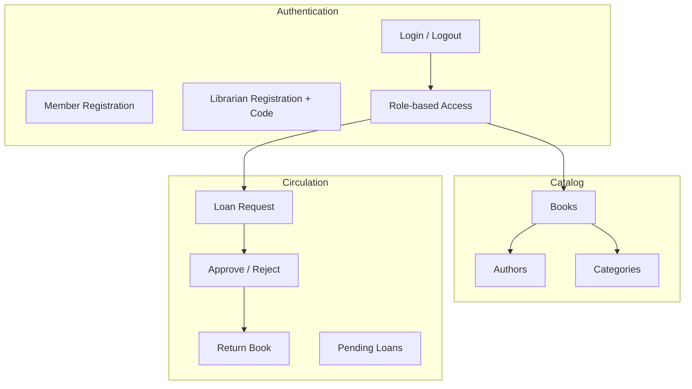
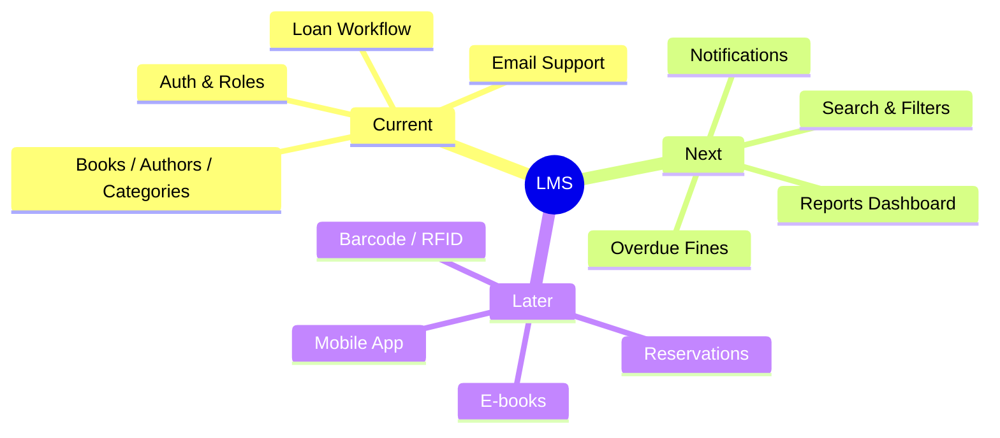

# LMS App MVC – Architecture & System Diagrams

This document contains the system architecture and key flow diagrams for the Library Management System.

---

## 1. High-Level Architecture

---

## 2. Layered Architecture

---

## 3. Domain Entity Relationships

---

## 4. Loan Workflow

### Loan Sequence

---

## 5. Authentication Flow

---

## 6. Module Overview

---

## 7. Future Enhancements

---

**Notes**

- Diagrams are written in Mermaid and render on GitHub, GitLab, Notion, and VS Code.
- Update this file as new features are added.
